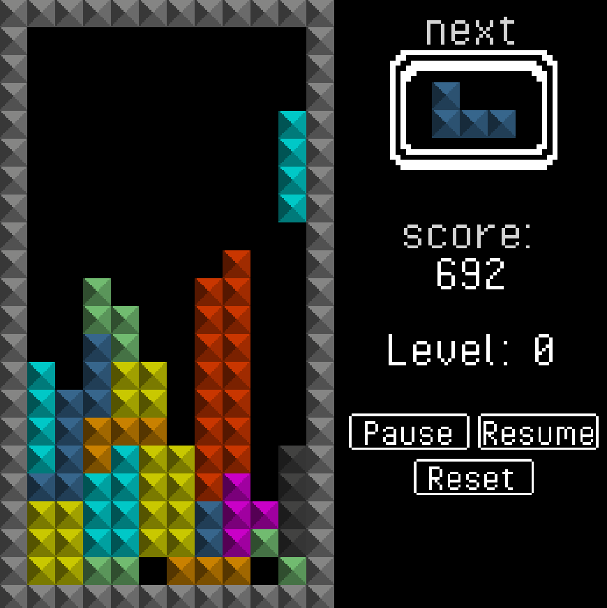

# Not Tetris (At all)
C'est Tetris. Projet réalisé avec Monogame.

Il faut avoir au minimum installer dotnet 8, perso, j'ai installé dotnet 9 mais il devrait pas y avoir d'énormes différences.

Savoir si dotnet est déjà installé : `dotnet --version`
> https://dotnet.microsoft.com/en-us/download

## Build le projet :
> git clone `https://github.com/CleverAxel/Csharp_Tetris.git`  
> cd Csharp_Tetris
> dotnet build -p:RestoreDotnetTools=true

Si le projet build correctement -> \^o^/
Sinon Copier-Coller le message d'erreur dans Google ou ChatGPT, et GL o7

## Pré-compiler les assets
> cd NotTetris  
> dotnet mgcb-editor ./Content/Content.mgcb

Ceci devrait ouvrir le "Content Pipeline Tool" de MonoGame, si ça ne marche c'est que le dotnet build, ne l'a pas installé correctement donc on peut l'installer à part :

> dotnet tool install --global dotnet-mgcb-editor (https://www.nuget.org/packages/dotnet-mgcb-editor)

La commande dotnet mgcb-editor devrait ouvrir une petite application, il va falloir cliquer sur le bouton "rebuild" et ensuite sur "enregistrer/save" et quitter.

Si la pré-compilation des assets se passe correctement, vous pouvez ensuite taper dans le terminal :
> dotnet run

Et le jeu devrait se lancer.

J'ai essayé sur Linux Mint (qui est basé sur Ubuntu) ainsi que sur Windows et le projet se compile/lance correctement.

